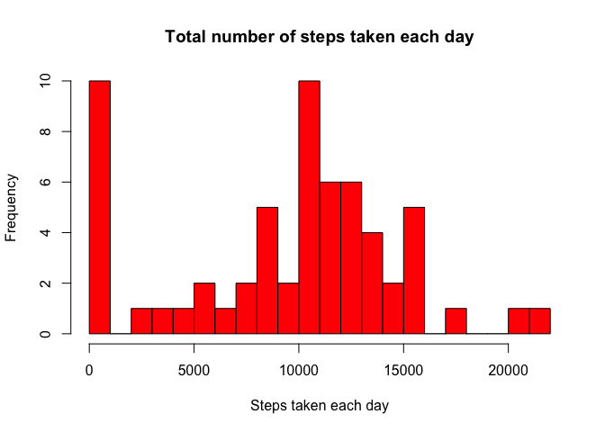
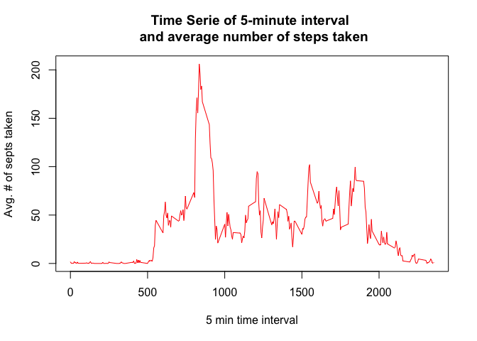
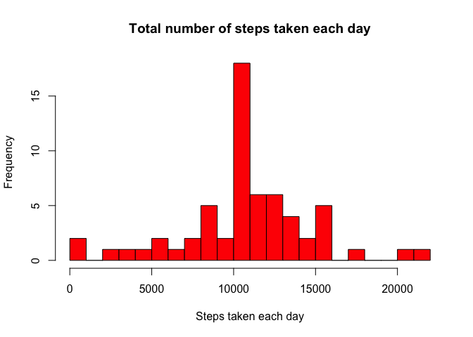
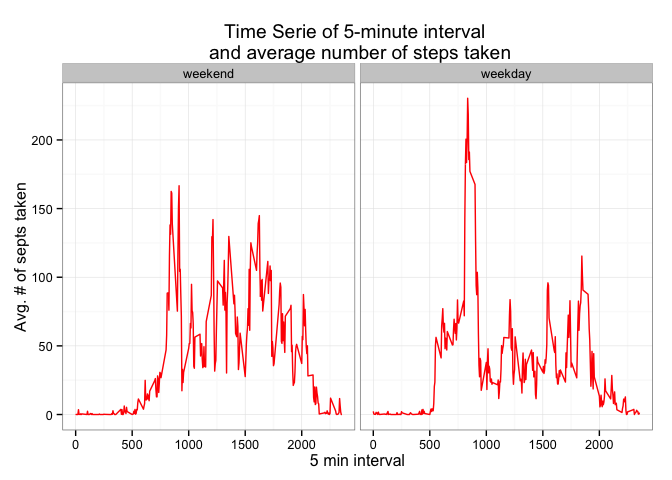

# Reproducible Research: Peer Assessment 1


## Loading and preprocessing the data
The following lines of code unzip, load and format the data in R

```r
      unzip('activity.zip',)
      activity<-read.table('activity.csv',sep=',',header = T,quote="\"",
                           colClasses=c('numeric','Date','numeric'))
```
## What is mean total number of steps taken per day?
The following lines of code performs the following tasks:  
<ol>
<li> Calculate the the total number of steps taken per day</li>
<li> Create a histogram of the total number of steps taken each day</li>
<li> Calculate and report the mean and median of the total number of steps taken per day</li>
</ol>

```r
      # Load the plyr package
      require(plyr)
```

```
## Loading required package: plyr
```

```r
      # Calculate the the total number of steps taken per day
      totalSteps<-ddply(activity,'date',summarise,stepsPerDay=sum(steps,na.rm=T))
      # Histogram of the total number of steps taken each day
      hist(totalSteps$stepsPerDay,breaks = 20,col='red',
            main='Total number of steps taken each day',xlab='Steps taken each day')
```

 

```r
      # Calculate the mean and median of the total number of steps taken per day
      centrality<-c(Mean=mean(totalSteps$stepsPerDay),Median=median(totalSteps$stepsPerDay))
      print(centrality)
```

```
##   Mean Median 
##   9354  10395
```

## What is the average daily activity pattern?
The following lines of code performs the following tasks:  
<ol>
<li> Make a time series plot of the 5-minute interval and the average number of steps taken, averaged across all days</li>
<li> Calculate the 5-minute interval maximum number of steps on average across all the days in the dataset</li>
</ol> 

```r
      # Calculate the average steps the 5-minutes interval average number of steps
      dailyActivity<-ddply(activity,'interval',summarise,dailyAvgSteps=mean(steps,na.rm=T))
      # Create the time serie plot
      plot(dailyActivity$interval,dailyActivity$dailyAvgSteps,type='l',col='red',
            main='Time Serie of 5-minute interval \n and average number of steps taken',
            xlab='5 min time interval',ylab='Avg. # of septs taken')
```

 

```r
      # 5-minute interval maximum number of steps on average across all the days
      subset(dailyActivity,dailyAvgSteps==max(dailyAvgSteps))
```

```
##     interval dailyAvgSteps
## 104      835         206.2
```
## Imputing missing values
The following lines of code performs the following tasks:  
<ol>
<li> Calculate and report the total number of missing values in the dataset</li>
<li> Create a new dataset that is equal to the original dataset but with the missing data filled in. To fill the missing values in the original dataset the mean of the the 5-minutes interval </li>
<li> Make a histogram of the total number of steps taken each day and Calculate and report the mean and median total number of steps taken per day</li>
</ol>

```r
      #Count the number of missing values
      sum(is.na(activity$steps))
```

```
## [1] 2304
```

```r
      # Extract the rows with missing values
      activityNA<-activity[is.na(activity$steps),]
      # Create a new dataset filling the missing values of the original dataset 
      activityNA$steps<-round(arrange(merge(activityNA,dailyActivity,by='interval')
                                    ,date,interval)[,'dailyAvgSteps'],0)
      activityNoNA<-arrange(rbind(na.omit(activity),activityNA),date,interval)
      # the total number of steps taken each day
      totalStepsNoNA<-ddply(activityNoNA,'date',summarise,stepsPerDay=sum(steps,na.rm=T))
      # Create a histogram of the the total number of steps taken each day
      hist(totalStepsNoNA$stepsPerDay,breaks = 20,col='red',
           main='Total number of steps taken each day',xlab='Steps taken each day')
```

 

```r
      # Calculate the median and mean of the total number of steps taken each day
      #summary(totalStepsNoNA$stepsPerDay)[c('Median','Mean')]
      centrality<-c(Mean=mean(totalStepsNoNA$stepsPerDay),Median=median(totalStepsNoNA$stepsPerDay))
      print(centrality)
```

```
##   Mean Median 
##  10766  10762
```


## Are there differences in activity patterns between weekdays and weekends?
The following lines of code performs the following tasks:  
<ol>
<li> Create a new factor variable in the dataset with two levels – “weekday” and “weekend” indicating whether a given date is a weekday or weekend day.</li>
<li> Make a panel plot containing a time series plot of the 5-minute interval (x-axis) and the average number of steps taken, averaged across all weekday days or weekend days </li>
</ol>

```r
      # Load the package timeDate
      require(timeDate)
```

```
## Loading required package: timeDate
```

```
## Warning: package 'timeDate' was built under R version 3.1.2
```

```r
      # Create a factor variable with the following two labels: weekday and weekend
      activityNoNA$dayType<-factor(isWeekday(activity$date),labels=c('weekend','weekday'))
      # Calculate the mean steps by 5-minutes interval and dayType 
      dayTypeActivity<-ddply(activityNoNA,c('interval','dayType'),summarise,dailyAvgSteps=mean(steps))
      # Load the package ggplot2
      require(ggplot2)
```

```
## Loading required package: ggplot2
```

```r
      # Make a panel plot containing a time series plots of the 5-minute interval and the average number of
      # steps taken, averaged across all weekday days or weekend days.
      ggplot(dayTypeActivity,aes(x=interval,y=dailyAvgSteps)) + geom_line(colour='red') + 
      facet_grid(.~dayType) +
      theme_bw() + 
      labs(x='5 min interval',y='Avg. # of septs taken',
                        title='Time Serie of 5-minute interval \n and average number of steps taken')
```

 
